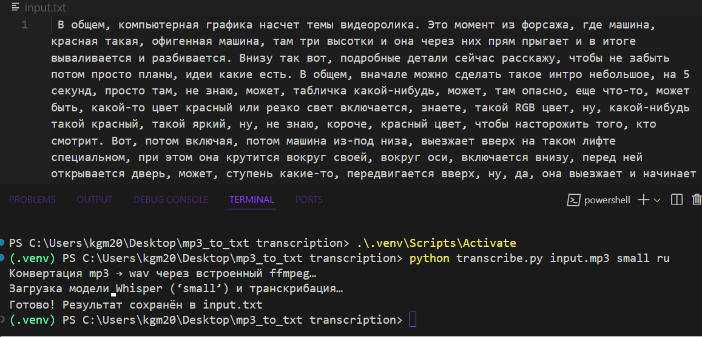

# **_LLM Audio Transcriber_**

## About
This project demonstrates an AI-powered audio-to-text transcription system.  
It leverages modern **Speech Recognition** techniques and **Natural Language Processing (NLP)** models to automatically convert `.mp3` (or other audio formats) into clean and structured `.txt` files.  

The goal of this project is to provide a simple, extensible, and production-ready pipeline for transcribing audio data into text — useful for podcasts, lectures, interviews, and meeting notes.

### Key Features
* **Audio Support** : Works with `.mp3` (extendable to `.wav`, `.flac`, etc.).
* **Transcription Engine** : Based on state-of-the-art speech recognition and optionally enhanced with Large Language Models (LLMs) for better text cleaning and formatting.
* **Text Output** : Generates structured `.txt` transcripts, ready for further NLP tasks (summarization, keyword extraction, sentiment analysis).
* **Customizable** : Easy to integrate with other AI/NLP pipelines.
* **CLI & Script Usage** : Run directly from the command line or import as a Python module.

> version: Aug 2025, created by Gleb 'Faitsuma' Kiryakov

---

## Project Structure

### Code Overview
1. **Audio Preprocessing** :
   * Input `.mp3` files are converted into a standard format.
   * Audio is normalized and prepared for transcription.
2. **Transcription Engine** :
   * Speech-to-Text model converts audio into raw transcripts.
   * Optional: Post-processing with LLM to improve readability and grammar.
3. **Output Handling** :
   * Results are saved as `.txt` files with proper formatting.
   * Can be extended to export JSON/CSV for structured use.

---

## How to Use

### Prerequisites
Install the required dependencies:
```
pip install -r requirements.txt
```
### Running the Code
1. Clone this repository:
```
git clone https://github.com/Faitsumaru/audio2text-ai
cd audio2text-ai
```
2. Activate your evironment:
```
.\.venv\Scripts\Activate
```

3. Run the script:
```
python transcribe.py input.mp3 small ru
```

4. Output:
* The transcribed text will be saved in the `outputs/` directory.

---

## Example

<div align="center">
    
</div>

---

## Documentation & References
* [Speech Recognition](https://pypi.org/project/SpeechRecognition/)
* [OpenAI Whisper](https://github.com/openai/whisper)
* [Natural Language Processing (NLP)](https://en.wikipedia.org/wiki/Natural_language_processing)
* [Python](https://docs.python.org/3/)